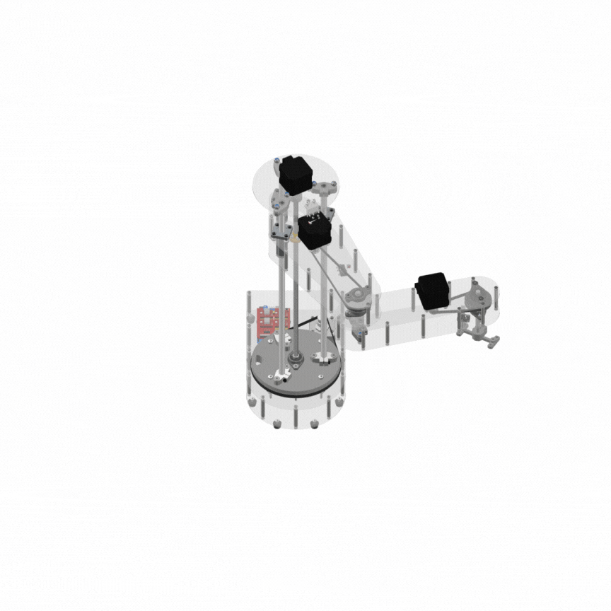
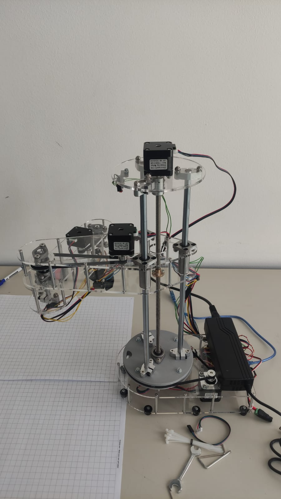

# Desenvolvimento de um Robô Manipulador SCARA para Fins Didáticos

Este repositório contém os recursos de um projeto focado na conceção, implementação e validação de um robô manipulador SCARA de baixo custo, desenvolvido especificamente para fins didáticos no ensino de robótica. O objetivo é proporcionar uma plataforma prática para o estudo de conceitos fundamentais da mecatrónica e controlo robótico.

  <div align="center">
      
      <em>Um GIF que ilustra o design e os movimentos do robô no software CAD.</em>
  </div>

## Descrição do Projeto

O robô é um manipulador do tipo SCARA com 4 graus de liberdade (GDL), onde a sua cinemática inversa foi implementada para uma configuração de 3 GDL (2 rotacionais e 1 prismático), com um 4º GDL rotacional no efetuador final. A sua estrutura é projetada para simplicidade, boa visibilidade dos componentes e fácil acesso, utilizando materiais como acrílico (corte a laser) e PLA (impressão 3D).

<div align="center">
  
</div>


## Conteúdo do Repositório

* **`💻 /code/arduino`**: Contém o firmware desenvolvido em C/C++ para a placa Arduino Uno, responsável pelo controlo de baixo nível dos motores de passo e do servo motor. Utiliza a biblioteca AccelStepper para perfis de movimento suaves.
* **`🐍 /code/python`**: Contém o software de alto nível (HMI - Interface Gráfica do Utilizador) desenvolvido em Python. Este software realiza cálculos cinemáticos, gere a comunicação serial com o Arduino, e permite a interação do utilizador, incluindo o controlo manual e a gestão de sequências de movimento.
* **`📐 /cad`**: Contém os modelos 3D do manipulador SCARA, desenhados em software CAD (Autodesk Inventor). Inclui ficheiros para corte a laser (.dxf) e impressão 3D (.stl), que podem ser utilizados para replicar a estrutura mecânica.
* **`📄 /docs`**: (A ser adicionado) Documentação detalhada do projeto, incluindo o relatório final, que aborda a fundamentação teórica, o processo de design, a análise cinemática, os testes experimentais e as conclusões.
* **`🎥 /videos`**: Contém vídeos demonstrativos dos testes de funcionamento do robô, incluindo operações de "pick and place" e outros movimentos.

## Principais Funcionalidades e Características ✨

* **Conceção Modular:** Integração de subsistemas mecânicos, eletrónicos e de software.
* **Controlo Abrangente:** Implementação de modelos de cinemática direta e inversa para controlo de movimento preciso.
* **Controlo Eletrónico:** Baseado em Arduino Uno e CNC Shield V3, com drivers A4988 para motores de passo e servo motor para a garra.
* **Interação com Utilizador:** HMI em Python que permite controlo por coordenadas cartesianas/angulares e gestão de sequências.
* **Plataforma Didática:** Recurso de baixo custo e replicável para aprendizagem prática de robótica.

## Demonstrações Visuais ▶️

Aqui pode encontrar exemplos visuais do robô em funcionamento:

    
* **Vídeos dos Testes:**
    [](https://www.youtube.com/watch?v=VIDEO_ID_1)
    _Vídeo 1: Teste de Exatidão e Precisão Posicional._
    [](https://www.youtube.com/watch?v=VIDEO_ID_2)
    _Vídeo 2: Demonstração da Tarefa de Pick and Place com Peças de LEGO._

## Como Utilizar 🛠️

Para configurar e operar o robô, siga os passos abaixo:

### Requisitos de Hardware

Certifique-se de que possui os seguintes componentes montados e conectados conforme o diagrama de ligações:

* **Placa Microcontroladora:** Arduino UNO
* **Shield de Expansão:** CNC Shield V3
* **Drivers de Motor de Passo:** 4x A4988
* **Motores de Passo:** 4x NEMA 17 (Modelos HS4023 e 17HS4401S)
* **Servo Motor:** 1x MG996R (para a garra)
* **Sensores de Fim de Curso:** 4x Micro-interruptores de fim de curso
* **Fonte de Alimentação:** 12V (capacidade mínima de 5A, idealmente 9A)
* **Conversor Step-Down:** Para fornecer 5V ao servo motor (se não for alimentado pelo Arduino).
* **Estrutura Mecânica:** Componentes do braço, transmissão (correias e polias), base.

### Requisitos de Software

* **Ambiente de Desenvolvimento Arduino:**
    * Arduino IDE
    * Biblioteca AccelStepper: Pode ser instalada via Gestor de Bibliotecas do Arduino IDE.

* **Ambiente de Desenvolvimento Python:**
    * Python 3.x
    * Bibliotecas Python (podem ser instaladas via `pip`):
        ```bash
        pip install pyserial
        pip install PySide6 # ou PyQt6
        pip install numpy
        pip install pygame
        ```

### Passos de Configuração e Execução

1.  **Montagem do Hardware:** Siga os diagramas de ligação e as instruções de montagem mecânica para construir o robô.
2.  **Upload do Firmware:**
    * Abra o ficheiro `.ino` do firmware localizado em `/code/arduino` na Arduino IDE.
    * Conecte o Arduino ao computador via USB.
    * Selecione a porta e a placa corretas na Arduino IDE.
    * Carregue o firmware para o Arduino.
3.  **Execução do Software HMI:**
    * Navegue até a pasta `/code/python` no seu terminal/linha de comandos.
    * Execute o script principal (geralmente `main.py` ou `hmi.py`):
        ```bash
        python seu_script_principal.py
        ```
4.  **Conexão e Calibração:**
    * A interface gráfica deverá iniciar.
    * Verifique a porta serial correta nas configurações do software Python (se aplicável).
    * Estabeleça a comunicação.
    * Execute a rotina de calibração automática ("Homing") no robô usando a GUI.
5.  **Operação:** Uma vez calibrado, poderá utilizar os controlos da HMI para movimentar o robô, criar e executar sequências, e testar as suas funcionalidades.

## Contribuição 🤝

Este projeto é um esforço académico que visa contribuir para o ensino da robótica. 

